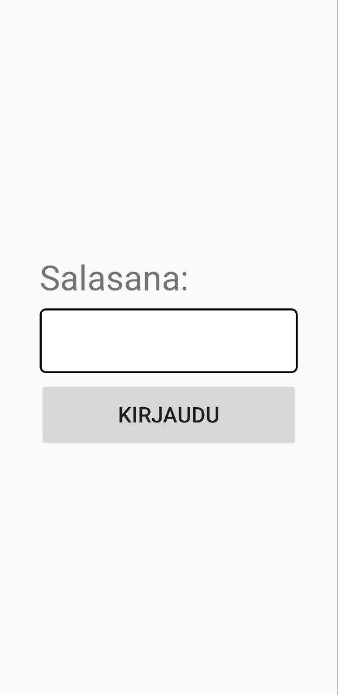
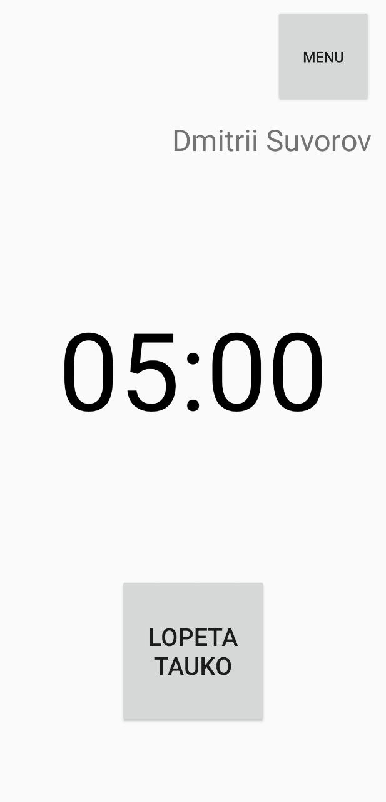
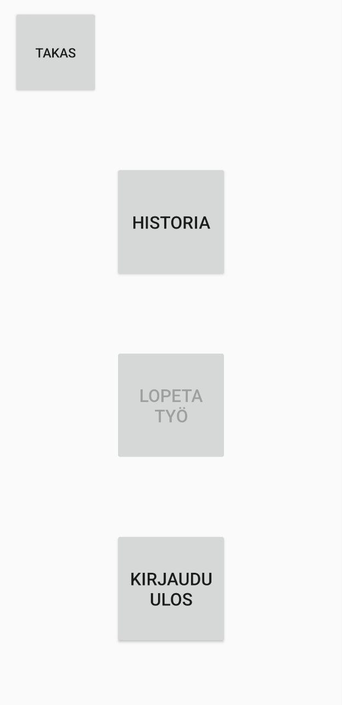

# Work time app

A minimalistic android application written in Java for tracking the working hours. 

The request to make it came from my father who is working as a truck driver. The applications they have to use in their work are often made without consideration of the harsh work environment and constant hurry. They have small buttons, little texts, many colors and poorly planned structure. 

After researching the domain and going through iterations of redesigning the UI according to the requirements, I wrote my version of the tool. For now it has the basic functionality and clear UI with protection against accidental clicks. After testing the app in the real environment a new set of changes to make was accomodated, so the project is still in the developing phase.

	
	
	

